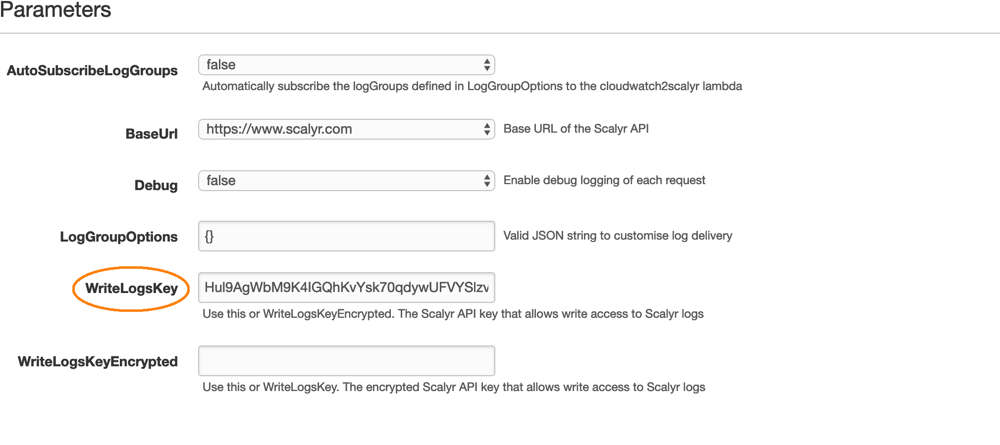

# Scalyr CloudWatch Logs Importer

* [Scalyr CloudWatch Logs Importer](#scalyr-cloudWatch-logs-importer)
  * [Features](#features)
  * [Requirements](#requirements)
  * [Deployment](#deployment)
    * [Using CloudFormation](#using-cloudformation)
  * [Configuration](#configuration)
    * [Customizing LogGroupOptions](#customizing-loggroupoptions)
      * [Using regex to customise log delivery options](#using-regex-to-customise-log-delivery-options)
      * [LogGroupOptions defaults](#loggroupoptions-defaults)
    * [Automatically subscribing CloudWatch logGroups](#automatically-subscribing-cloudwatch-loggroups)
  * [Troubleshooting](#troubleshooting)

Amazon CloudWatch is a monitoring and logging service for the AWS ecosystem that provides visibility into your cloud resources and applications.

*But why dig into another logging system?*

Deploy the *Scalyr CloudWatch Logs Importer* using the guide below and stream your CloudWatch Logs to Scalyr in real-time.

## Features

* Deploy quickly and easily using CloudFormation.
* Automatic configuration of your logGroups to subscribe to the *CloudWatch Streamer* Lambda function.
* Customise Scalyr log delivery options and AWS logGroup subscription filters on a per-logGroup basis, or by using wildcard matching/regex.

## Requirements

1. An application, service, or resource that is currently sending logs to CloudWatch.
2. A Scalyr Write Logs API key.
3. (Optional) If you chose to enable `AutoSubscribeLogGroups` in the configuration, you will need CloudTrail logging
enabled (have at least one trail) for any future log groups to be auto-subscribed.

## Deployment

### Using CloudFormation

1. Click -> [](https://console.aws.amazon.com/cloudformation/home?#stacks/create/review?stackName=ScalyrCloudWatchLogsImporter&templateURL=https://scalyr-aws-serverless.s3.amazonaws.com/cloudwatch_logs/cloudwatch-logs-1.0.8.yml)
2. Change the region on the top right of the console if required:

   
3. You must set either the `WriteLogsKey` or `WriteLogsKeyEncrypted` parameter using your Scalyr logs API key that has write privileges to Scalyr logs.

    
    * You can encrypt your Scalyr WriteLogsKey with KMS using [aws-cli](https://aws.amazon.com/cli/):

      ```bash
      ~$ aws kms encrypt \
          --key-id a1234567-012b-3c45-6789-ab123cd4e5f6 \
          --plaintext Hul9AgWbM9K4IGQhKvYsk70qdywUFVYSlzvVJZaKZTWk-

      {
        "KeyId": "arn:aws:kms:us-east-1:123456789:key/a1234567-012b-3c45-6789-ab123cd4e5f6",
        "CiphertextBlob": "4llcfg4vQ3k41iS6ozjWWilAPtGcTxRhKWPCTM0q1hGtSt5DK3raMwbk57JLRejIivI6cuSNMrP78g7htS1LitHshDXmk8IrRwlC2DV/zs3kiywrT6UBzaxLh9vGA2kSBA"
      }
      ```

      * Simply use the `CiphertextBlob` output for the `WriteLogsKeyEncrypted` parameter

4. That's all!
    * However you wont see anything in the Scalyr dashboard until your CloudWatch logGroups have been configured to stream logs to the *CloudWatch Streamer* Lambda function

    * For each logGroup that you want to stream to Scalyr you'll have to
    [Create a Subscription Filter](https://docs.aws.amazon.com/AmazonCloudWatch/latest/logs/SubscriptionFilters.html#LambdaFunctionExample). You can do this through the `aws-cli` or the Console.

      **However** *Scalyr CloudWatch Logs Importer* can also do this for you!!

      * See the configuration parameters described below, specifically `AutoSubscribeLogGroups` and `LogGroupOptions`

## Configuration

The *Scalyr CloudWatch Logs Importer* only needs to know your Scalyr Write Logs API Key to be able to operate. However if you'd like to customise how your logs are delivered, you are able to do that using the parameters described below:

Parameter | Default | Description
------------ | ------------- | ------------
AutoSubscribeLogGroups | false | Automatically subscribe the logGroups defined in LogGroupOptions to the CloudWatch Streamer Lambda function
BaseUrl | https://www.scalyr.com/ | Base URL of the Scalyr API
Debug | false | Enable debug logging of each request
LogGroupOptions | {} | Valid JSON string to customise log delivery
WriteLogsKey | "" | Use this or WriteLogsKeyEncrypted. The Scalyr API key that allows write access to Scalyr logs
WriteLogsKeyEncrypted | "" | Use this or WriteLogsKey. The encrypted Scalyr API key that allows write access to Scalyr logs

### Customising LogGroupOptions

Scalyr log delivery options are customised by providing a JSON object as a string to the `LogGroupOptions` parameter. These are the same options described in the documentation for the [Scalyr Upload Logs API](https://www.scalyr.com/help/api-uploadLogs)

```javascript
  {
    "/aws/lambda/my_func_1": {
      "serverHost": "AWSLambda",
      "logfile": "/aws/lambda/my_func_1",
      "parser": "my_func_parser"
    },
    "/aws/lambda/my_func_2": {
      "parser": "my_func_parser"
    },
    "/aws/lambda/other_func_1": {
      "parser": "other_func_parser"
    },
    "/aws/lambda/other_func_2": {
      "parser": "other_func_parser"
    }
  }
```

Additionally to the options described in the [Scalyr Upload Logs API](https://www.scalyr.com/help/api-uploadLogs), you
 can configure a log group with an `attributes` field to include constant server fields to your messages.

```
  {
    "log/dev/.*": {
      "attributes": {
        "tier": "dev",
        "department": "mydept"
      }
    }
  }
```

#### Using regex to customise log delivery options

The above `LogGroupOptions` can be simplified to the below, using valid regex.

```javascript
  {
    "/aws/lambda/myfunc_[1-9]": {
      "parser": "my_func_parser"
    },
    "/aws/lambda/other_func_[1-9]": {
      "parser": "other_func_parser"
    }
  }
```

**Note:**

  1. You can test your regex using [Pythex](https://pythex.org/) to see which logGroups will be matched
  2. Any ommitted fields will use the defaults below

#### Sampling and Redaction rules

You can define Sampling and Redaction rules per logGroup using the same options described in the documentation
of the Scalyr Agent Configuration.

[Sampling documentation](https://app.scalyr.com/help/scalyr-agent#filter),
[Redaction documentation](https://app.scalyr.com/help/scalyr-agent#redaction)

```javascript
  {
    "/aws/lambda/myfunc_[1-9]": {
      "parser": "my_func_parser",
      "sampling_rules": [
        { "match_expression": "INFO", "sampling_rate": 0.1 },
        { "match_expression": "FINE", "sampling_rate": 0 }
      ]
    },
    "/aws/lambda/other_func_[1-9]": {
      "parser": "other_func_parser",
      "redaction_rules": [
        // Delete all instances of password=...
        { "match_expression": "password=[^& ]*" },

        // Replace terms like "userInfo=username password" with "userInfo=username"
        {
          "match_expression": "userInfo=([^ ]+) [^ ]+",
          "replacement": "userInfo=\\1"
        }
      ]
    }
  }
```

#### LogGroupOptions defaults

Parameter | Default | Description
------------ | ------------- | ------------
serverHost | cloudwatch-{account_id} | Specifies the server name
logfile | logGroup name from CloudWatch | Specifies the log file name
parser | cloudWatchLogs | See the [Scalyr Documentation](https://www.scalyr.com/help/parsing-logs)
filterName | cloudWatchLogs | The name of the AWS Subscription Filter
filterPattern | "" | See the [AWS Documentation](https://docs.aws.amazon.com/AmazonCloudWatch/latest/logs/FilterAndPatternSyntax.html)
sampling_rules | {} | See the [Scalyr Agent Documentation](https://app.scalyr.com/help/scalyr-agent#filter)
redaction_rules | {} | See the [Scalyr Agent Documentation](https://app.scalyr.com/help/scalyr-agent#redaction)
prefix_timestamp | false | Append the system timestamp to the beginning of the line

### Automatically subscribing CloudWatch logGroups

1. `AutoSubscribeLogGroups` works in conjunction with `LogGroupOptions`.  You'll need set it to `true` and then provide a JSON string to the `LogGroupOptions` parameter specifying which logGroups to subscribe. You can also provide a valid `filterPattern` and `filterName` as described in the
    [CloudWatch Documenatation](https://docs.aws.amazon.com/AmazonCloudWatch/latest/logs/FilterAndPatternSyntax.html)

    ```javascript
      {
        "/aws/lambda/myfunc_[1-9]": {
          "parser": "my_func_parser"
        },
        "/aws/lambda/other_func_[1-9]": {
          "parser": "other_func_parser",
          "filterName" "error_filter",
          "filterPattern": "ERROR"
        }
      }
    ```

**Note:**

  1. Any ommitted fields will [use the defaults](#loggroupoptions-defaults)
  2. Any existing logGroup matching the supplied regex will be subscribed to the *CloudWatch Streamer* Lambda function as part of the CloudFormation stack deployment
  3. CloudTrail logging must be enabled for any future logGroups to be automatically subscribed to the *CloudWatch Streamer* Lambda

## Troubleshooting

1. Enable `debug` in the Stack parameters and review the
   [CloudWatch logGroup](https://console.aws.amazon.com/cloudwatch/home) output for the *Scalyr CloudWatch Logs Importer* Lambda function
